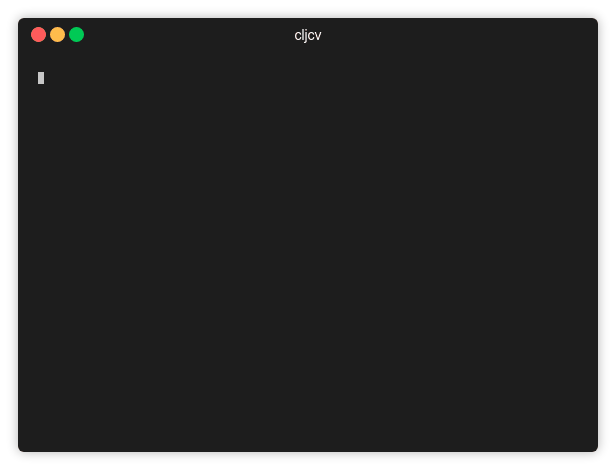
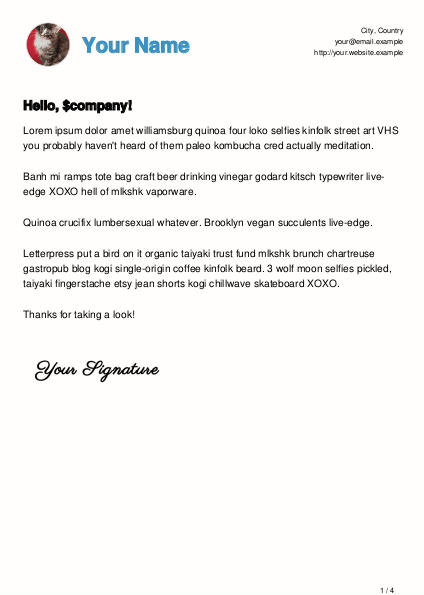

# cljcv

> Produce a nicely formatted curriculum vitae or résumé in various formats.




## Installation

Download the [latest release](https://github.com/logankoester/cljcv/releases),
then add an executable wrapper script to your $PATH, like this:

```bash
#!/bin/sh
exec /usr/bin/java -jar '/path/to/cljcv-$VERSION-SNAPSHOT-standalone.jar' "$@"
```

## Usage

First, create a new project skeleton.

```
$ mkdir ~/cv
$ cd ~/cv
$ cljcv init
```

The `data/default.clj` file is your default CV. Once you've completed it, you may create additional variants, such as
adding cover letters for specific companies.

You should also add your avatar, signature, company logos, and skill icon images to the `resources` directory.

When you're finished, produce the output by running:

```
$ cljcv build
```

## License

Copyright 2019 Logan Koester <logan@logankoester.com>

Permission is hereby granted, free of charge, to any person obtaining a copy of this software and associated documentation files (the "Software"), to deal in the Software without restriction, including without limitation the rights to use, copy, modify, merge, publish, distribute, sublicense, and/or sell copies of the Software, and to permit persons to whom the Software is furnished to do so, subject to the following conditions:

The above copyright notice and this permission notice shall be included in all copies or substantial portions of the Software.

THE SOFTWARE IS PROVIDED "AS IS", WITHOUT WARRANTY OF ANY KIND, EXPRESS OR IMPLIED, INCLUDING BUT NOT LIMITED TO THE WARRANTIES OF MERCHANTABILITY, FITNESS FOR A PARTICULAR PURPOSE AND NONINFRINGEMENT. IN NO EVENT SHALL THE AUTHORS OR COPYRIGHT HOLDERS BE LIABLE FOR ANY CLAIM, DAMAGES OR OTHER LIABILITY, WHETHER IN AN ACTION OF CONTRACT, TORT OR OTHERWISE, ARISING FROM, OUT OF OR IN CONNECTION WITH THE SOFTWARE OR THE USE OR OTHER DEALINGS IN THE SOFTWARE.
